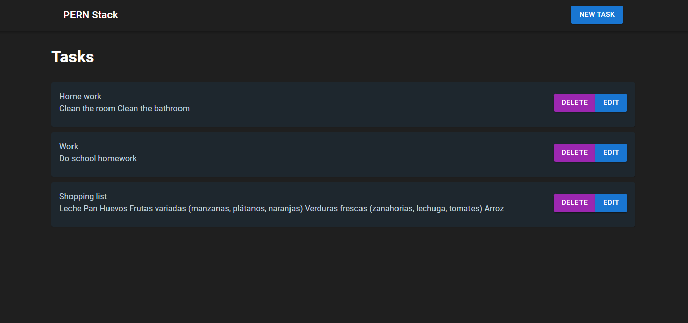
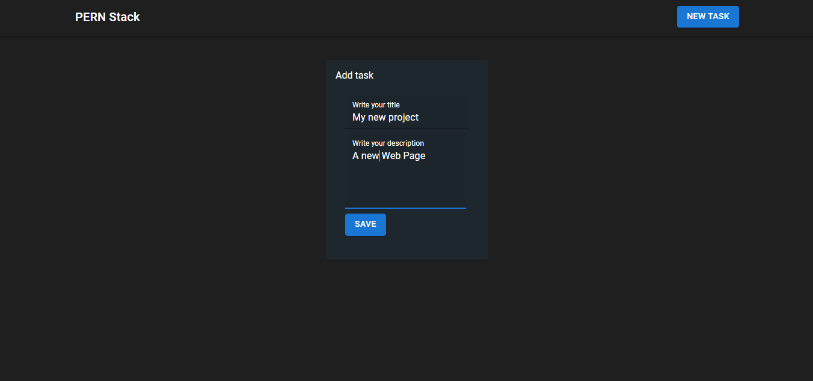
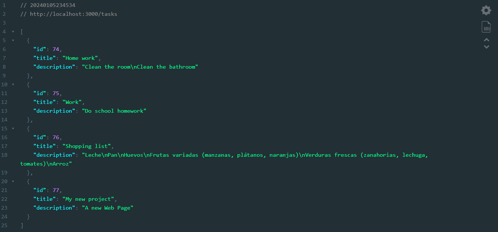

# To-Do List

## Project Create With React, PostgresSQL, Express y NodeJS

## Description

This project is a task manager (To-Do List) with a simple interface that allows the user to perform CRUD (Create, Read, Update, Delete) operations. When adding a new task, the user is redirected to a form, where they can enter the title and description. This data is sent to the backend with Node.js and Express. Each task is stored in a PostgreSQL database, providing a REST API that is consumed from the frontend to represent the user's tasks. On the client side, technologies such as React, Material UI have been used for interface design and React Router Dom for page routing.

## Characteristics

* CRUD operations.
* Server side with Node.js, Express and PostgreSQL.
* CLient side wirh React, React Router Dom and MaterialUI.
* API REST.

## Screenshots





## Install

Clone this repository:

```bash
git clone https://github.com/Chencho34/todo-app-pern-stack
```

Install the dependencies:

```bash
npm install
```

## Execute Server

```bash
npm run dev
```

## Execute Client

```bash
cd client
```

```bash
npm run dev
```

Runs the server and client.
Open [http://localhost](http://localhost) to view it in your browser.

The page will reload when you make changes.
You may also see any lint errors in the console.

## Author

Developer: Chencho34

## Implemented technologies.

Back-End:
* [PostgresSQL](https://www.postgresql.org/)
* [NodeJS](https://nodejs.org/en)
* [Express](https://expressjs.com/es/)
  * Tools:
    * [Morgan](https://www.npmjs.com/package/morgan)
    * [Cors](https://www.npmjs.com/package/cors)
    * [Nodemon](https://nodemon.io/)

Front-End:
* [React](https://react.dev/)
* [React Router Dom](https://reactrouter.com/en/main)
* [MaterialUI](https://mui.com/)
